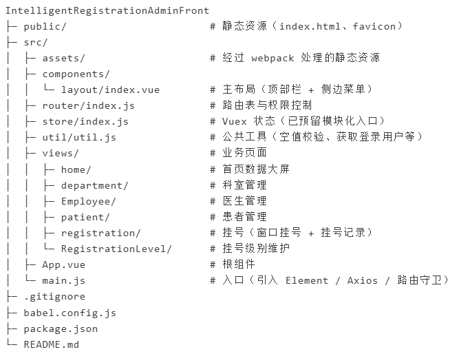
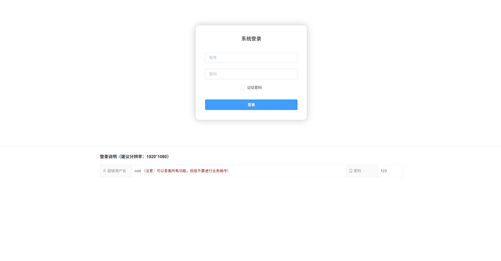
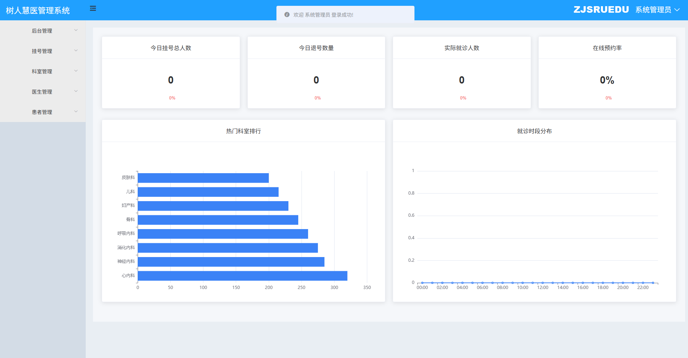
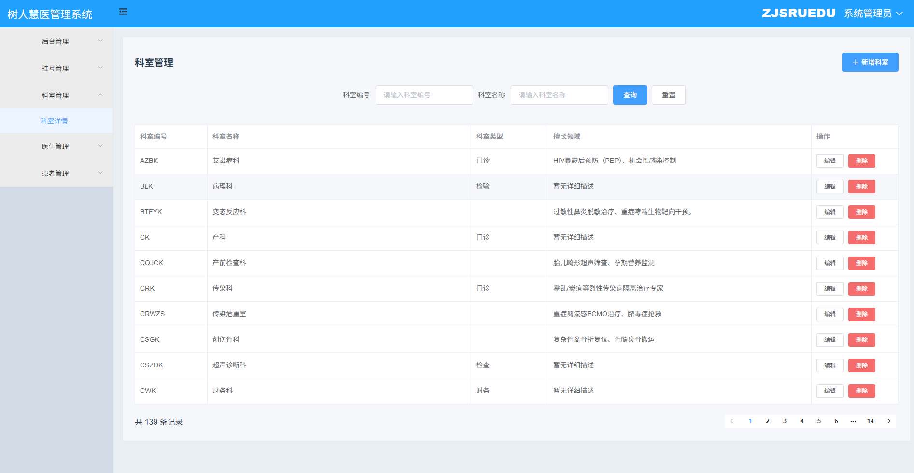
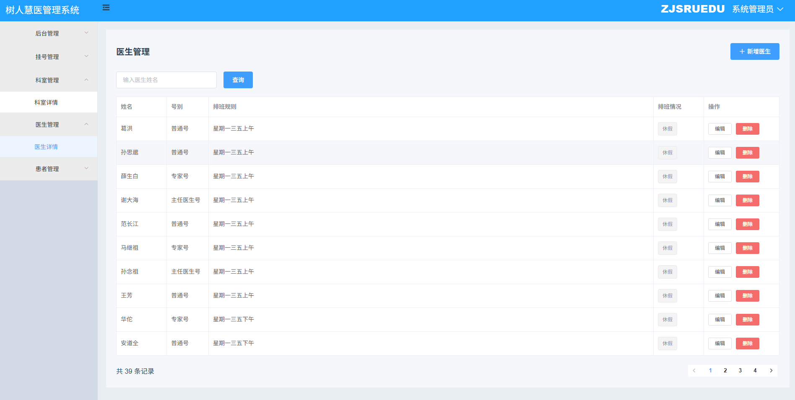
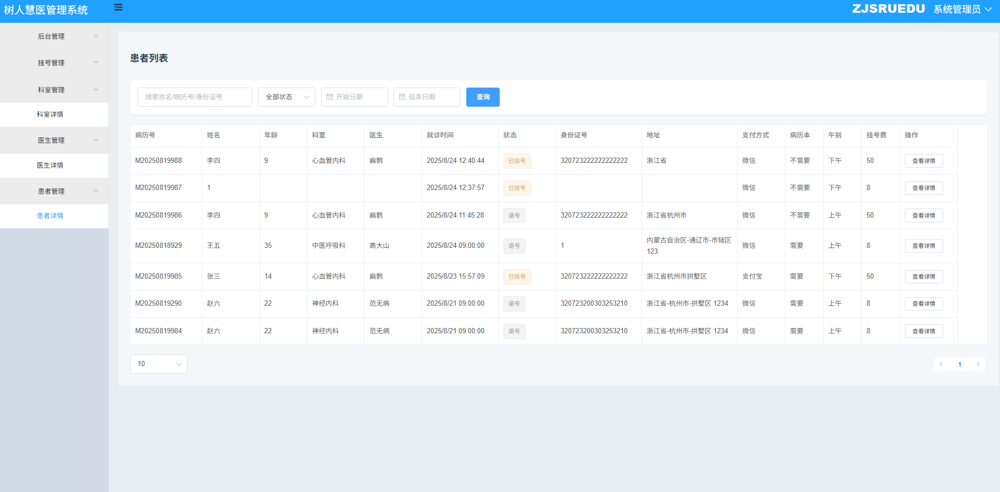
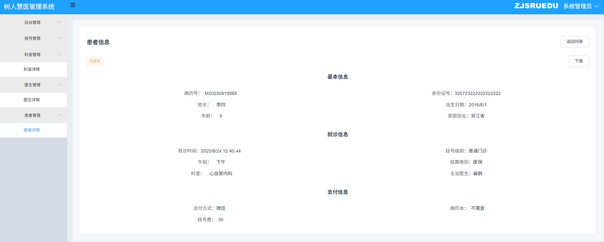
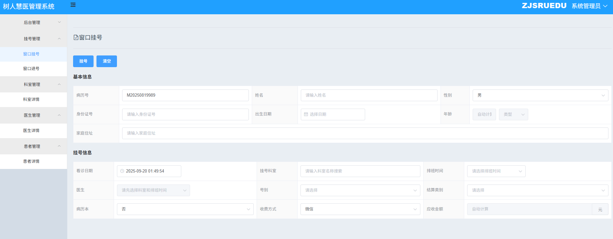
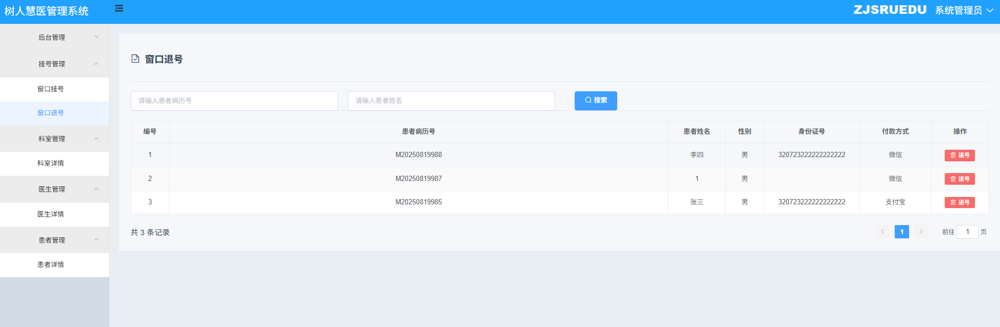

# 智能医院挂号系统管理员前端

### 介绍  
本项目是「智能医院挂号系统」的管理网页端，基于 **Vue2 + Element-UI + Vuex + Vue-Router** 构建，负责医院内部 **科室、医生、患者、挂号、退号、挂号级别** 等核心业务的可视化运营管理。

智能挂号项目分别放在三个代码仓库：

1.用户端网页代码仓库： https://github.com/Yancheng-s/IntelligentRegistrationUserFront
2.管理员端网页代码仓库： https://github.com/Yancheng-s/IntelligentRegistrationAdminFront
3.后端代码仓库： https://github.com/Yancheng-s/IntelligentRegistrationBack

### 项目特色
- 🚀 开箱即用的医院管理模板  
- 📊 可视化数据大屏（今日挂号、退号、就诊率、热门科室等）  
- 🧩 模块化业务页面（科室 / 医生 / 患者 / 挂号 / 退号 / 挂号级别）  
- 🔐 基于 Session 的路由守卫与权限控制  
- 📄 患者详情一键导出 PDF（html2pdf.js）

### 软件架构
| 技术栈        | 说明                     |
|---------------|--------------------------|
| 框架          | Vue2 + Vue-Router + Vuex |
| UI 组件库     | Element-UI 2.15          |
| 图表          | ECharts 5.6              |
| PDF 导出      | html2pdf.js              |
| HTTP          | Axios（统一封装在 Vue.prototype.$http） |
| 构建工具      | Vue CLI 4                |

### 快速开始
#### 环境要求
- Node.js ≥ 14  
- npm / yarn / pnpm

#### 安装依赖
```bash
npm install
```

### 开发运行

```
npm run serve
```

### 生产构建

```
npm run build
```

### 核心功能
| 功能模块   | 状态 | 描述                        |
| ------ | -- | ------------------------- |
| 登录     | ✅  | 多角色账号（超级管理员 / 挂号员 / 医生 …） |
| 首页大屏   | ✅  | 今日挂号、退号、实诊、预约率等实时指标与图表    |
| 科室管理   | ✅  | 科室增删改查、擅长领域维护             |
| 医生管理   | ✅  | 医生排班、级别、在岗状态实时识别          |
| 患者管理   | ✅  | 患者列表、就诊状态筛选、详情导出 PDF      |
| 窗口挂号   | ✅  | 现场挂号、自动计算年龄/费用、支持多种支付方式   |
| 窗口退号   | ✅  | 根据病历号或姓名快速退号              |

### 项目结构


### 页面速览
| 模块   | 访问路径                 | 文件名约定                   | 预览                                             |
| ---- | -------------------- | ----------------------- | ---------------------------------------------- |
| 登录页  | /                    | login.png               |                 |
| 首页大屏 | /home                | home.png                |                   |
| 科室管理 | /department          | department.png          |             |
| 医生管理 | /employee            | employee.png            |               |
| 患者列表 | /patient             | patient-list.png        |         |
| 患者详情 | /patient/detail      | patient-detail.png      |       |
| 窗口挂号 | /onsite-registration | onsite-registration.png |  |
| 窗口退号 | /registration-record | refund.png              |                 |

### 开发规范

- 统一使用 ESLint + Prettier 格式化
- 组件名 PascalCase，页面文件小写+连字符
- 业务接口统一使用 this.$http（Axios）
- 所有下拉数据（科室、级别、结算类别）均走接口，支持搜索与懒加载
- 图表组件按需引入 ECharts，支持响应式 resize

### 版本历史

- v1.0.0 - 基础功能完成

    1. 多角色登录 / 路由守卫
    2. 首页数据大屏 & 图表
    3. 科室 / 医生 / 患者 / 挂号 / 退号 / 级别管理
    4. 患者详情 PDF 导出

致谢
如果本项目对您有帮助，请给颗 ⭐ 鼓励一下！


